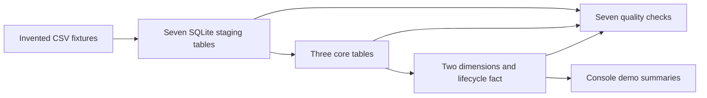

# Research Ops Data Architecture

A small, reproducible data-engineering work sample: synthetic workflow records,
a Python/SQLite pipeline, seven data-quality checks, and a companion T-SQL
architecture design. Run the local demo without credentials, packages, or network access.

**Evidence boundary:** the SQLite subset runs locally. The SQL Server / Azure SQL
scripts are design artifacts; they have not been executed in this release review.
This project does not establish production deployment, real users, clinical
validity, or measured operational savings.

## Try it in two minutes

From the repository root, with Python 3.11 or newer:

```bash
PYTHONPATH=src python3 -m unittest discover -s tests -v
PYTHONPATH=src python3 scripts/demo.py
```

The demo uses temporary files and an in-memory database. It verifies that all
seven committed CSVs match the generator, repeats generation byte for byte,
prints lifecycle summaries, and deliberately introduces stale exports and an
invalid status transition to show detection. Compare [recorded output](docs/demo-output.txt).

To regenerate the committed CSVs and quality report:

```bash
PYTHONPATH=src python3 -m research_ops_architecture.cli
```

Expected fixture: **12 requests, 48 author approvals, 101 events, 10 reminders,
5 document metadata rows, 12 dashboard summaries, and 12 project-status rows**.
The reference date is fixed at **2026-07-01**; “current exports” means current
relative to that fixture date, not today's date. No documents are generated or sent.

## What to inspect

| Engineering evidence | Where to look | Scope |
| --- | --- | --- |
| Reproducible fixtures and explicit provenance | [Generator](src/research_ops_architecture/synthetic.py), [provenance](docs/synthetic-data-provenance.md) | Invented labels and deterministic dates; no imported dataset |
| Staging, relational loading, lifecycle aggregation | [SQLite implementation](src/research_ops_architecture/sqlite_mirror.py) | Three core tables, two dimensions, one fact table |
| Quality gates and negative examples | [Checks](src/research_ops_architecture/quality.py), [tests](tests/test_quality_failures.py) | Specific failure cases; not comprehensive data validation |
| Schema and reporting design | [T-SQL](sql/azure_sql), [architecture](docs/architecture.md) | Unexecuted design, including incomplete fact loaders |
| Reasoned tradeoffs | [Case study](docs/case-study.md), [ADRs](docs/adrs) | Lightweight local reproducibility versus engine parity |

## Architecture at a glance



See [lineage](docs/lineage.md), [dictionary](docs/data-dictionary.md), and
[known limitations](docs/known-limitations.md) for the implemented scope.
[Interview notes](docs/case-study.md#interview-walkthrough) connect the evidence
to data engineering and research software roles. [Contribution notes](docs/contributions.md)
separate repository evidence from personal authorship claims.

## Licence and status

This project uses the MIT licence in [LICENSE](LICENSE) for its code,
documentation, and synthetic fixtures. See
[third-party notices](THIRD_PARTY_NOTICES.md).
No vendor runtime, binary, image, document corpus, or historical Git metadata is bundled.
