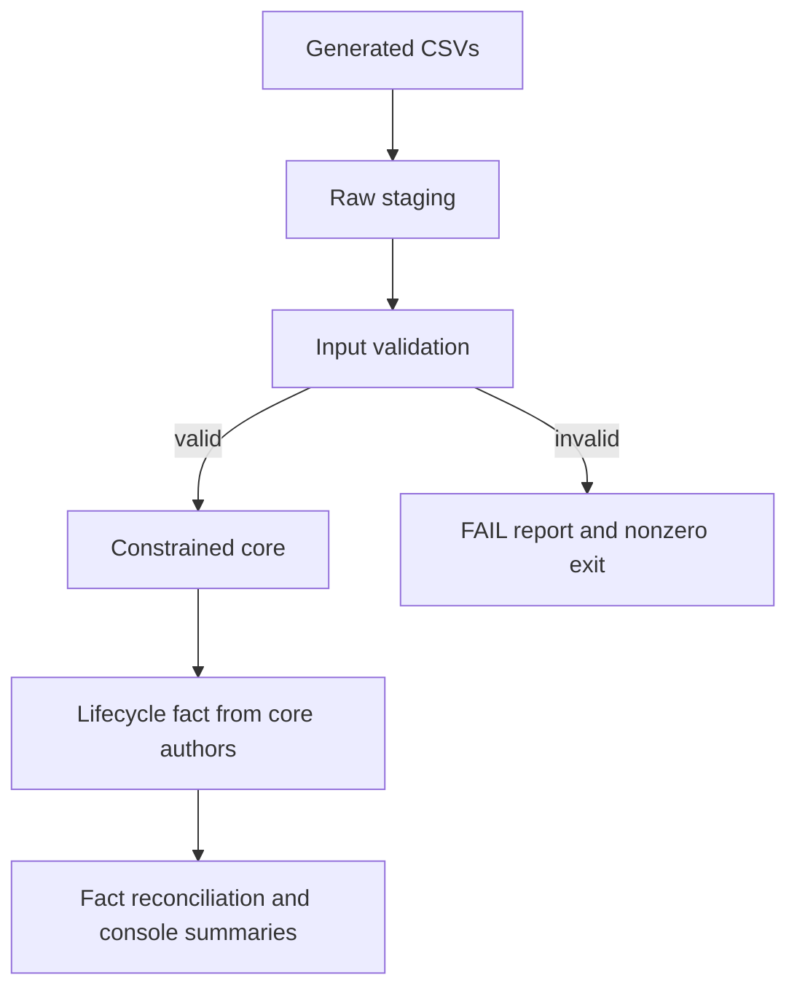

# Research Ops Data Architecture

Turn synthetic approval-workflow CSVs into validated relational records and a
request-lifecycle reporting fact. The Python/SQLite demo runs locally without
credentials or third-party runtime packages; companion T-SQL scripts show the
SQL Server schema, loading, reporting, and daily author-history design.

## Run the demo

From the repository root with Python 3.11 or newer:

```bash
PYTHONPATH=src python3 -m unittest discover -s tests -v
PYTHONPATH=src python3 scripts/demo.py
```

The demo checks committed fixtures against two fresh generations, prints lifecycle
summaries, and demonstrates rejected data. It uses temporary files and an in-memory
database. [Recorded output](docs/demo-output.txt).

To rebuild CSVs and the quality report:

```bash
PYTHONPATH=src python3 -m research_ops_architecture.cli
```

To validate existing input files, add `--skip-generate --data-dir PATH --report PATH`.
Failed inputs produce a FAIL report and a nonzero exit code. Core loading happens
only after input validation; constrained core tables remain a second backstop.

## Follow the data



The fixture contains 12 requests, 48 author approvals, 121 events, 14 reminders,
5 document metadata rows, and 12 rows each of dashboard/project context. Labels
are invented; dates are anchored to **2026-07-01** for repeatability.

## Engineering walkthrough

- [Case study](docs/case-study.md): workflow questions, decisions, and interview walkthrough.
- [Architecture](docs/architecture.md) and [lineage](docs/lineage.md): implemented layers and fact grain.
- [Data dictionary](docs/data-dictionary.md): columns, types, nullability, meanings, and keys generated from DDL.
- [Quality report](docs/quality-report.md) and [failure tests](tests/test_cli_failures.py): input and reporting contracts.
- [SQL Server test](docs/sql-server-integration.md): disposable engine integration harness.
- [Design decisions](docs/adrs) and [query notes](docs/query-plan-notes.md).

## Scope

This is a personal engineering work sample using [generated data](docs/synthetic-data-provenance.md).
The [CI workflow](https://github.com/roberthlane/research-ops-data-architecture-portfolio/actions/workflows/ci.yml)
checks Python and SQL Server behavior. [Engine evidence and scope](docs/sql-server-integration.md).
The project has no production deployment or user-impact claims.
[Remaining scope](docs/scope.md).

## Development and licence

Install development tools with `python -m pip install -r requirements-dev.txt`, then run
`make check PYTHON=python`. This is the same command CI uses: lint, formatting, strict
types, tests, generated-artifact comparisons, and a source/wheel build with a clean
console-install smoke test. It leaves generated files unchanged and builds in scratch storage.
Run `make refresh PYTHON=python` to deliberately update the generated artifacts.

SQL Server is separate: `make check-sql PYTHON=python SQL_SERVER_ARGS=--accept-eula`
requires an amd64 Docker engine and accepts the container EULA. CI runs it in its
own job. Push checks run on main; pull requests cover proposed branch changes.

Robert Lane maintains this personal project with AI-assisted development and review.
Code, documentation, and synthetic fixtures use the [MIT licence](LICENSE).
[Third-party notices](THIRD_PARTY_NOTICES.md).
