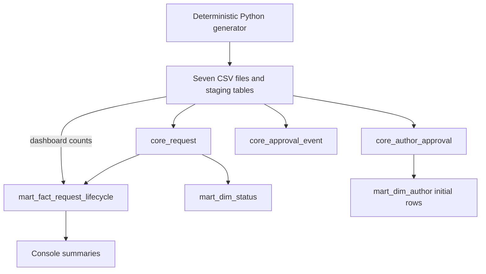

# Lineage

## Executed local path

Reminders, generated-document metadata, and project status are loaded to staging
but not transformed to SQLite core/facts. Request and author events share the
approval-event table, with nullable author-approval IDs distinguishing request events.
The diagram describes the executable subset, not all T-SQL declarations.

## T-SQL design

Script 04 loads request/author/event/reminder/document core entities and lookup
tables. Script 05 loads dimensions and the lifecycle fact. Other declared fact
tables have no loaders. Reporting reminder counts join core reminders directly,
not `mart.fact_reminder`. See the implementation matrix and limitations.

## Quality gates

Checks examine duplicate request keys, parent requests for authors/events,
request status transitions, required lifecycle dates, dashboard freshness, and
core/lifecycle fact counts. They run after load/build. Foreign-key and NOT NULL
errors may stop loading before these checks. “Summary” is a data shape, not a
privacy clearance for future real records.
